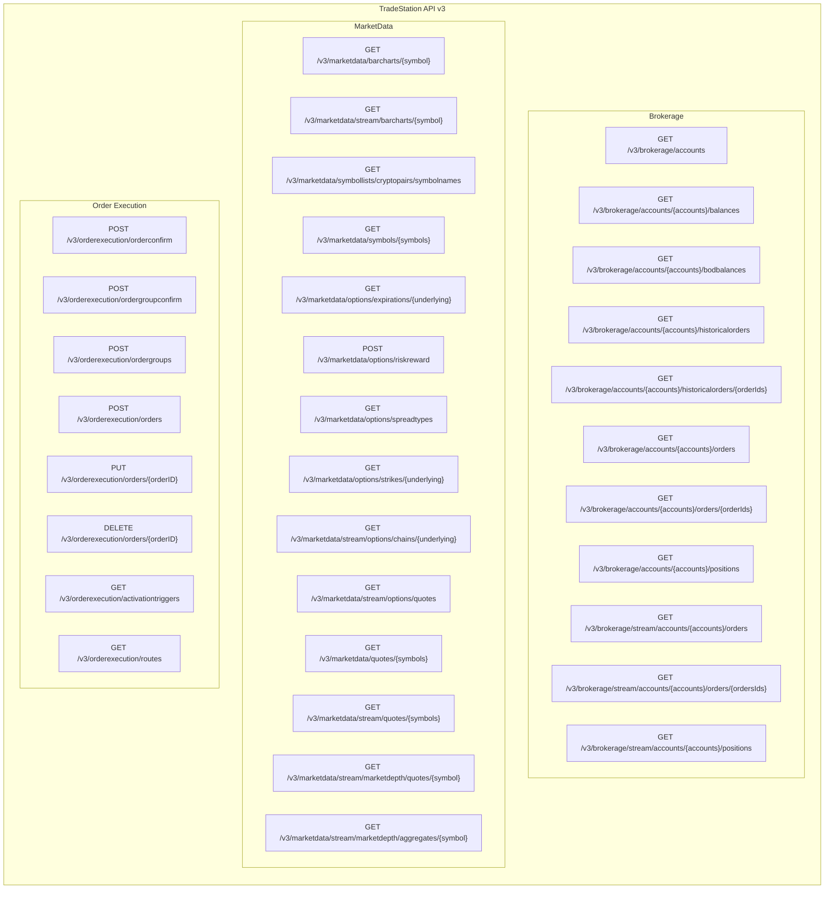

# TradeStation API v3 Structure Diagram

## Metadata

- **Status:** Active
- **Created:** 12-05-2025
- **Last Updated:** 12-05-2025 14:02:18 EST
- **Version:** 1.0
- **Description:** Visual diagram showing TradeStation API v3 endpoint structure organized by tag groups (Brokerage, MarketData, Order Execution)
- **Type:** Architecture Diagram - Technical reference for developers and AI agents
- **Applicability:** When understanding API structure, planning SDK enhancements, or reviewing endpoint coverage
- **Dependencies:**
  - [`tradestation-api-v3-openapi.json`](../tradestation-api-v3-openapi.json) - Source OpenAPI specification
  - [`API_STRUCTURE_DETAILED.md`](./API_STRUCTURE_DETAILED.md) - Related detailed endpoint relationship diagram
- **How to Use:** Open this file in Cursor/VS Code markdown preview (Cmd+Shift+V / Ctrl+Shift+V), view on GitHub, or paste the Mermaid code into [Mermaid Live Editor](https://mermaid.live) to see the rendered diagram

---

## API Structure Overview

---

## Endpoint Summary

- **Brokerage:** 11 endpoints (account, position, order management)
- **MarketData:** 14 endpoints (market data, quotes, symbols, streaming)
- **Order Execution:** 8 endpoints (order placement, modification, cancellation)
- **Total:** 33 v3 endpoints

---

## How to View This Diagram

### In Cursor/VS Code
- The diagram will render automatically in the markdown preview
- Open this file and use the preview pane (Cmd+Shift+V / Ctrl+Shift+V)

### In GitHub
- Navigate to the file on GitHub - diagrams render automatically

### Online
- Copy the Mermaid code block and paste into [Mermaid Live Editor](https://mermaid.live)
- Or use any Mermaid-compatible viewer

### In Other Markdown Viewers
- Most modern markdown viewers (Obsidian, Typora, etc.) support Mermaid diagrams
- Some may require Mermaid plugin/extension

---

**Related Files:**
- [`API_STRUCTURE_DETAILED.md`](./API_STRUCTURE_DETAILED.md) - Detailed endpoint relationships
- [`tradestation-api-v3-openapi.json`](../tradestation-api-v3-openapi.json) - Complete OpenAPI specification
