# TradeStation API v3 Detailed Structure Diagram

## Metadata

- **Status:** Active
- **Created:** 12-05-2025
- **Last Updated:** 12-05-2025 14:02:18 EST
- **Version:** 1.0
- **Description:** Detailed visual diagram showing relationships between TradeStation API v3 tag groups and their endpoints
- **Type:** Architecture Diagram - Technical reference for developers and AI agents
- **Applicability:** When understanding detailed API endpoint relationships or reviewing SDK implementation structure
- **Dependencies:**
  - [`tradestation-api-v3-openapi.json`](../tradestation-api-v3-openapi.json) - Source OpenAPI specification
  - [`API_STRUCTURE.md`](./API_STRUCTURE.md) - Related complete API structure diagram
- **How to Use:** Open this file in Cursor/VS Code markdown preview (Cmd+Shift+V / Ctrl+Shift+V), view on GitHub, or paste the Mermaid code into [Mermaid Live Editor](https://mermaid.live) to see the rendered diagram

---

---

## Detailed API Structure

```mermaid
graph LR
    subgraph "TradeStation API v3 Endpoints"
        direction TB
        Brokerage["Brokerage<br/>11 endpoints"]
        Brokerage --> v3brokerageaccounts["GET<br/>accounts"]
        Brokerage --> v3brokerageaccountsa["GET<br/>balances"]
        Brokerage --> v3brokerageaccountsa2["GET<br/>bodbalances"]
        Brokerage --> v3brokerageaccountsa3["GET<br/>historicalorders"]
        Brokerage --> v3brokerageaccountsa4["GET<br/>{orderIds}"]
        MarketData["MarketData<br/>14 endpoints"]
        MarketData --> v3marketdatabarchart["GET<br/>barcharts/{symbol}"]
        MarketData --> v3marketdatastreamba["GET<br/>stream/barcharts"]
        MarketData --> v3marketdatasymbolli["GET<br/>cryptopairs"]
        MarketData --> v3marketdatasymbolss["GET<br/>symbols/{symbols}"]
        MarketData --> v3marketdataoptionse["GET<br/>options/expirations"]
        OrderExecution["Order Execution<br/>8 endpoints"]
        OrderExecution --> v3orderexecutionorde["POST<br/>orderconfirm"]
        OrderExecution --> v3orderexecutionorde2["POST<br/>ordergroupconfirm"]
        OrderExecution --> v3orderexecutionorde3["POST<br/>ordergroups"]
        OrderExecution --> v3orderexecutionorde4["POST<br/>orders"]
        OrderExecution --> v3orderexecutionorde5["PUT<br/>orders/{orderID}"]
    end
```

**Note:** This diagram shows a subset of endpoints for clarity. See [`API_STRUCTURE.md`](./API_STRUCTURE.md) for the complete diagram with all 33 endpoints.

---

## How to View This Diagram

### In Cursor/VS Code
- The diagram will render automatically in the markdown preview
- Open this file and use the preview pane (Cmd+Shift+V / Ctrl+Shift+V)

### In GitHub
- Navigate to the file on GitHub - diagrams render automatically

### Online
- Copy the Mermaid code block and paste into [Mermaid Live Editor](https://mermaid.live)
- Or use any Mermaid-compatible viewer

### In Other Markdown Viewers
- Most modern markdown viewers (Obsidian, Typora, etc.) support Mermaid diagrams
- Some may require Mermaid plugin/extension

---

**Related Files:**
- [`API_STRUCTURE.md`](./API_STRUCTURE.md) - Complete API structure diagram
- [`tradestation-api-v3-openapi.json`](../tradestation-api-v3-openapi.json) - Complete OpenAPI specification
