# TradeStation SDK - Order Functions Reference

## About This Document

This is a **detailed reference guide** for all order-related functions in the SDK. It provides comprehensive documentation for order placement, modification, cancellation, and querying with detailed parameters, return types, and examples.

**Use this if:** You're working with orders, need detailed parameter information, or want to understand order execution patterns.

**Related Documents:**
- 📚 **[API_REFERENCE.md](API_REFERENCE.md)** - Complete API reference (includes orders)
- 💡 **[SDK_USAGE_EXAMPLES.md](SDK_USAGE_EXAMPLES.md)** - Order usage examples
- 📊 **[API_ENDPOINT_MAPPING.md](API_ENDPOINT_MAPPING.md)** - Order endpoint mappings
- 📋 **[CHEATSHEET.md](../CHEATSHEET.md)** - Quick order code snippets
- ⚠️ **[LIMITATIONS.md](../LIMITATIONS.md)** - Order-related limitations (trailing stops, etc.)

## Metadata

- **Status:** Active
- **Created:** 12-05-2025
- **Last Updated:** 12-05-2025 14:21:15 EST
- **Version:** 1.0.0
- **Description:** Detailed reference guide for all order-related functions in the TradeStation SDK, including parameters, return types, API endpoints, code examples, and access patterns
- **Type:** Function Reference - Technical reference for developers implementing order operations
- **Applicability:** When implementing order operations, understanding order function parameters, or reviewing order execution patterns
- **Dependencies:**
  - [`SDK_FUNCTIONS_LIST.md`](./SDK_FUNCTIONS_LIST.md) - Quick list of all SDK functions
  - [`API_REFERENCE.md`](./API_REFERENCE.md) - Complete API reference
  - [`SDK_USAGE_EXAMPLES.md`](./SDK_USAGE_EXAMPLES.md) - Usage examples
  - [`order_executions.py`](../order_executions.py) - Order execution operations implementation
  - [`orders.py`](../orders.py) - Order query operations implementation
- **How to Use:** Reference this document when implementing order operations, understanding function parameters, or looking up order function documentation

---

---

## Table of Contents

- [Overview](#overview)
- [Architecture Diagram](#architecture-diagram)
- [Order Execution Functions](#order-execution-functions)
- [Order Execution Convenience Functions](#order-execution-convenience-functions)
- [Order Query Functions](#order-query-functions)
- [Order Streaming Functions](#order-streaming-functions)
- [Utility Functions](#utility-functions)
- [Access Patterns](#access-patterns)
- [Summary](#summary)

---

## Overview

The TradeStation SDK provides comprehensive order management capabilities through two main operation classes:

1. **OrderExecutionOperations** - Handles order placement, modification, cancellation, and group orders
2. **OrderOperations** - Handles order queries, history, and streaming

All functions are accessible via the main `TradeStationSDK` class or directly through the operation classes.

**Total Unique Order-Related Functions:** 25 core functions

---

## Architecture Diagram

The following diagram shows the relationships between order-related classes and functions:

```mermaid
graph TB
    SDK[TradeStationSDK<br/>Main SDK Class]
    
    SDK -->|delegates to| OEO[OrderExecutionOperations<br/>Order Execution]
    SDK -->|delegates to| OO[OrderOperations<br/>Order Queries]
    SDK -->|delegates to| SM[StreamingManager<br/>Real-time Streaming]
    
    OEO -->|uses| HTTP[HTTPClient<br/>API Requests]
    OO -->|uses| HTTP
    SM -->|uses| HTTP
    
    OEO -->|uses| AO[AccountOperations<br/>Account Info]
    OO -->|uses| AO
    
    subgraph "Order Execution Functions"
        OEO --> PO[place_order]
        OEO --> CO[cancel_order]
        OEO --> MO[modify_order]
        OEO --> GOE[get_order_executions]
        OEO --> CFO[confirm_order]
        OEO --> CFGO[confirm_group_order]
        OEO --> PGO[place_group_order]
        OEO --> GAT[get_activation_triggers]
        OEO --> GR[get_routes]
    end
    
    subgraph "Convenience Functions"
        OEO --> PLO[place_limit_order]
        OEO --> PSO[place_stop_order]
        OEO --> PSLO[place_stop_limit_order]
        OEO --> PTSO[place_trailing_stop_order]
        OEO --> POCO[place_oco_order]
        OEO --> PBO[place_bracket_order]
    end
    
    subgraph "Order Query Functions"
        OO --> GOH[get_order_history]
        OO --> GCO[get_current_orders]
        OO --> GOBI[get_orders_by_ids]
        OO --> GHOBI[get_historical_orders_by_ids]
        OO --> SO1[stream_orders]
    end
    
    subgraph "Streaming Functions"
        SM --> SO2[stream_orders]
        SM --> SOBI[stream_orders_by_ids]
    end
    
    subgraph "Utilities"
        MAP[mappers] --> NO[normalize_order]
    end
    
    style SDK fill:#e1f5ff
    style OEO fill:#fff4e1
    style OO fill:#fff4e1
    style SM fill:#e8f5e9
    style HTTP fill:#f3e5f5
    style AO fill:#f3e5f5
```



---

## Order Execution Functions

These functions handle order placement, modification, cancellation, and execution details using the `/orderexecution/` API endpoints.

### 1. `place_order()`

**Description:** Places an order with support for multiple order types (Market, Limit, Stop, StopLimit, TrailingStop).

**Location:** `OrderExecutionOperations.place_order()` / `TradeStationSDK.place_order()`

**Parameters:**
- `symbol` (str): Trading symbol (e.g., "MNQZ25")
- `side` (str): "BUY" or "SELL"
- `quantity` (int): Number of contracts
- `order_type` (str): "Market", "Limit", "Stop", "StopLimit", "TrailingStop" (default: "Market")
- `limit_price` (float | None): Limit price for Limit or StopLimit orders (optional)
- `stop_price` (float | None): Stop price for Stop or StopLimit orders (optional)
- `time_in_force` (str): "DAY", "GTC", "IOC", "FOK" (default: "DAY")
- `trail_amount` (float | None): Trail amount in price units/points for TrailingStop (optional)
- `trail_percent` (float | None): Trail percentage for TrailingStop (optional, e.g., 1.0 for 1%)
- `mode` (str | None): "PAPER" or "LIVE" (optional)

**Returns:** `tuple[str | None, str]` - (order_id, status_message)

**API Endpoint:** `POST /v3/orderexecution/orders`

**Example:**
```python
order_id, status = sdk.place_order(
    symbol="MNQZ25",
    side="BUY",
    quantity=2,
    order_type="Market",
    mode="PAPER"
)
```

---

### 2. `cancel_order()`

**Description:** Cancels an order by order ID.

**Location:** `OrderExecutionOperations.cancel_order()` / `TradeStationSDK.cancel_order()`

**Parameters:**
- `order_id` (str): TradeStation order ID to cancel
- `mode` (str | None): "PAPER" or "LIVE" (optional)

**Returns:** `tuple[bool, str]` - (success, message)

**API Endpoint:** `DELETE /v3/orderexecution/orders/{orderID}`

**Example:**
```python
success, message = sdk.cancel_order("924243071", mode="PAPER")
```

---

### 3. `modify_order()`

**Description:** Modifies an existing order (quantity, limit_price, stop_price).

**Location:** `OrderExecutionOperations.modify_order()` / `TradeStationSDK.modify_order()`

**Parameters:**
- `order_id` (str): TradeStation order ID to modify
- `quantity` (int | None): New quantity (optional)
- `limit_price` (float | None): New limit price (optional, for limit orders)
- `stop_price` (float | None): New stop price (optional, for stop orders)
- `mode` (str | None): "PAPER" or "LIVE" (optional)

**Returns:** `tuple[bool, str]` - (success, message)

**API Endpoint:** `PUT /v3/orderexecution/orders/{orderID}`

**Example:**
```python
success, message = sdk.modify_order(
    order_id="924243071",
    quantity=3,
    limit_price=25010.00,
    mode="PAPER"
)
```

---

### 4. `is_order_filled()`

**Description:** Check if an order has been filled (convenience function).

**Location:** `OrderExecutionOperations.is_order_filled()` / `TradeStationSDK.is_order_filled()`

**Parameters:**
- `order_id` (str): TradeStation order ID
- `mode` (str | None): "PAPER" or "LIVE" (optional)

**Returns:** `bool` - True if order is filled (status "FLL" or "FLP"), False otherwise

**API Endpoint:** `GET /v3/brokerage/accounts/{accounts}/orders/{orderIds}`

**Example:**
```python
if sdk.is_order_filled("924243071", mode="PAPER"):
    print("Order is filled!")
    # Get execution details
    executions = sdk.get_order_executions("924243071", mode="PAPER")
    for exec in executions:
        print(f"Filled {exec['Quantity']} @ ${exec['Price']:.2f}")
```

---

### 5. `get_order_executions()`

**Description:** Gets execution details (fills) for a specific order, including partial fills.

**Location:** `OrderExecutionOperations.get_order_executions()` / `TradeStationSDK.get_order_executions()`

**Parameters:**
- `order_id` (str): TradeStation order ID
- `mode` (str | None): "PAPER" or "LIVE" (optional)

**Returns:** `list[dict[str, Any]]` - List of execution dictionaries with:
- `ExecutionID`: TradeStation execution ID
- `Symbol`: Trading symbol
- `TradeAction`: BUY or SELL
- `Quantity`: Number of contracts filled
- `Price`: Fill price
- `Commission`: Commission paid
- `ExchangeFees`: Exchange fees
- `ExecutionTime`: When execution occurred
- `Venue`: Execution venue

**API Endpoint:** `GET /v3/orderexecution/orders/{orderID}/executions`

**Example:**
```python
executions = sdk.get_order_executions("924243071", mode="PAPER")
for exec in executions:
    print(f"Execution {exec['ExecutionID']}: {exec['Quantity']} @ ${exec['Price']:.2f}")
```

---

### 6. `confirm_order()`

**Description:** Pre-flight check to get estimated cost and commission before placing an order.

**Location:** `OrderExecutionOperations.confirm_order()` / `TradeStationSDK.confirm_order()`

**Parameters:**
- `symbol` (str): Trading symbol
- `side` (str): "BUY" or "SELL"
- `quantity` (int): Number of contracts
- `order_type` (str): Order type (default: "Market")
- `limit_price` (float | None): Limit price (optional, for limit orders)
- `stop_price` (float | None): Stop price (optional, for stop orders)
- `time_in_force` (str): Time in force (default: "DAY")
- `mode` (str | None): "PAPER" or "LIVE" (optional)

**Returns:** `dict[str, Any]` - Confirmation details (EstimatedCost, EstimatedCommission, etc.)

**API Endpoint:** `POST /v3/orderexecution/orderconfirm`

**Example:**
```python
confirmation = sdk.confirm_order(
    symbol="MNQZ25",
    side="BUY",
    quantity=2,
    order_type="Limit",
    limit_price=25000.00,
    mode="PAPER"
)
print(f"Estimated Cost: ${confirmation.get('EstimatedCost', 0):.2f}")
```

---

### 7. `confirm_group_order()`

**Description:** Confirms a group order (OCO/Bracket) before placement. Validates the group order and returns estimated costs and commissions.

**Location:** `OrderExecutionOperations.confirm_group_order()` / `TradeStationSDK.confirm_group_order()`

**Parameters:**
- `group_type` (str): Group type ("OCO", "BRK", or "NORMAL")
- `orders` (list[dict[str, Any]]): List of order dictionaries (same format as `place_order()`)
- `mode` (str | None): "PAPER" or "LIVE" (optional)

**Returns:** `dict[str, Any]` - Confirmation details including estimated costs

**API Endpoint:** `POST /v3/orderexecution/ordergroupconfirm`

**Example:**
```python
group_orders = [
    {"AccountID": "SIM123456", "Symbol": "MNQZ25", "TradeAction": "Buy", ...},
    {"AccountID": "SIM123456", "Symbol": "MNQZ25", "TradeAction": "Sell", ...}
]
confirmation = sdk.confirm_group_order("OCO", group_orders, mode="PAPER")
```

---

### 8. `place_group_order()`

**Description:** Places a group order (OCO/Bracket). Submits a group of related orders. For OCO orders, if one fills, others are cancelled. For Bracket orders, used to exit positions with stop and limit orders.

**Location:** `OrderExecutionOperations.place_group_order()` / `TradeStationSDK.place_group_order()`

**Parameters:**
- `group_type` (str): Group type ("OCO", "BRK", or "NORMAL")
- `orders` (list[dict[str, Any]]): List of order dictionaries (same format as `place_order()`)
- `mode` (str | None): "PAPER" or "LIVE" (optional)

**Returns:** `dict[str, Any]` - GroupOrderResponse including:
- `GroupID`: Group order ID
- `GroupName`: Group order name
- `Type`: Group type
- `Orders`: List of order responses with OrderIDs

**API Endpoint:** `POST /v3/orderexecution/ordergroups`

**Example:**
```python
result = sdk.place_group_order("BRK", orders, mode="PAPER")
print(f"Group ID: {result.get('GroupID')}")
for order in result.get('Orders', []):
    print(f"  Order {order['OrderID']}: {order['Status']}")
```

---

### 9. `get_activation_triggers()`

**Description:** Gets available activation trigger keys for conditional orders. Activation triggers are required for placing orders with conditional activation (e.g., stop orders).

**Location:** `OrderExecutionOperations.get_activation_triggers()` / `TradeStationSDK.get_activation_triggers()`

**Parameters:**
- `mode` (str | None): "PAPER" or "LIVE" (optional)

**Returns:** `list[dict[str, Any]]` - List of trigger dictionaries with:
- `Key`: Trigger key (e.g., "STT", "STTN", "SBA")
- `Name`: Human-readable trigger name
- `Description`: Description of the trigger method

**API Endpoint:** `GET /v3/orderexecution/activationtriggers`

**Example:**
```python
triggers = sdk.get_activation_triggers(mode="PAPER")
for trigger in triggers:
    print(f"{trigger['Key']}: {trigger['Name']}")
```

---

### 10. `get_routes()`

---

### 11. `cancel_all_orders_for_symbol()`

**Description:** Cancel all open orders for a specific symbol.

**Location:** `OrderExecutionOperations.cancel_all_orders_for_symbol()` / `TradeStationSDK.cancel_all_orders_for_symbol()`

**Parameters:**
- `symbol` (str): Trading symbol to cancel orders for
- `account_ids` (str | None): Comma-separated account IDs (optional, uses default if None)
- `mode` (str | None): "PAPER" or "LIVE" (optional)

**Returns:** `list[dict[str, Any]]` - List of dictionaries with cancellation results:
- `order_id`: Order ID that was cancelled
- `symbol`: Trading symbol
- `success`: Whether cancellation succeeded
- `message`: Status message

**Dependencies:** HTTPClient.make_request, OrderExecutionOperations.cancel_order

**Example:**
```python
results = sdk.cancel_all_orders_for_symbol("MNQZ25", mode="PAPER")
for result in results:
    if result['success']:
        print(f"✅ Cancelled order {result['order_id']}")
    else:
        print(f"❌ Failed to cancel order {result['order_id']}: {result['message']}")
```

---

### 12. `cancel_all_orders()`

**Description:** Cancel all open orders for account(s).

**Location:** `OrderExecutionOperations.cancel_all_orders()` / `TradeStationSDK.cancel_all_orders()`

**Parameters:**
- `account_ids` (str | None): Comma-separated account IDs (optional, uses default if None)
- `mode` (str | None): "PAPER" or "LIVE" (optional)

**Returns:** `list[dict[str, Any]]` - List of dictionaries with cancellation results:
- `order_id`: Order ID that was cancelled
- `symbol`: Trading symbol
- `success`: Whether cancellation succeeded
- `message`: Status message

**Dependencies:** HTTPClient.make_request, OrderExecutionOperations.cancel_order

**Example:**
```python
results = sdk.cancel_all_orders(mode="PAPER")
successful = sum(1 for r in results if r['success'])
print(f"Cancelled {successful} of {len(results)} orders")
```

---

### 13. `replace_order()`

**Description:** Replace an order by canceling the old one and placing a new one. This is useful when you need to change symbol, side, or other parameters that cannot be modified with `modify_order()`.

**Location:** `OrderExecutionOperations.replace_order()` / `TradeStationSDK.replace_order()`

**Parameters:**
- `old_order_id` (str): Order ID to cancel
- `symbol` (str): New trading symbol
- `side` (str): "BUY" or "SELL" for new order
- `quantity` (int): Number of contracts for new order
- `order_type` (str): Order type for new order (default: "Market")
- `limit_price` (float | None): Limit price for new order (optional)
- `stop_price` (float | None): Stop price for new order (optional)
- `time_in_force` (str): Time in force for new order (default: "DAY")
- `trail_amount` (float | None): Trail amount for trailing stop (optional)
- `trail_percent` (float | None): Trail percentage for trailing stop (optional)
- `mode` (str | None): "PAPER" or "LIVE" (optional)

**Returns:** `tuple[str | None, str]` - (new_order_id, status_message). If cancellation fails, returns (None, error_message).

**Dependencies:** OrderExecutionOperations.cancel_order, OrderExecutionOperations.place_order

**Example:**
```python
# Replace a limit order with a market order
new_order_id, status = sdk.replace_order(
    old_order_id="924243071",
    symbol="MNQZ25",
    side="BUY",
    quantity=2,
    order_type="Market",
    mode="PAPER"
)

# Replace order with different symbol/side
new_order_id, status = sdk.replace_order(
    old_order_id="924243071",
    symbol="ESZ25",  # Different symbol
    side="SELL",     # Different side
    quantity=3,      # Different quantity
    order_type="Limit",
    limit_price=25000.00,
    mode="PAPER"
)
```

---

### 9. `get_routes()`

**Description:** Gets available routing options for order execution. Routing options determine how orders are executed (e.g., "Intelligent" routing).

**Location:** `OrderExecutionOperations.get_routes()` / `TradeStationSDK.get_routes()`

**Parameters:**
- `mode` (str | None): "PAPER" or "LIVE" (optional)

**Returns:** `list[dict[str, Any]]` - List of route dictionaries with routing options

**API Endpoint:** `GET /v3/orderexecution/routes`

**Example:**
```python
routes = sdk.get_routes(mode="PAPER")
for route in routes:
    print(f"Route: {route}")
```

---

## Order Execution Convenience Functions

These convenience functions wrap the low-level `place_order()` and `place_group_order()` methods with simpler interfaces.

### 10. `place_limit_order()`

**Description:** Convenience wrapper for placing limit orders.

**Location:** `OrderExecutionOperations.place_limit_order()` / `TradeStationSDK.place_limit_order()`

**Parameters:**
- `symbol` (str): Trading symbol
- `side` (str): "BUY" or "SELL"
- `quantity` (int): Number of contracts
- `limit_price` (float): Limit price (required)
- `time_in_force` (str): "DAY", "GTC", "IOC", "FOK" (default: "DAY")
- `mode` (str | None): "PAPER" or "LIVE" (optional)

**Returns:** `tuple[str | None, str]` - (order_id, status_message)

**Example:**
```python
order_id, status = sdk.place_limit_order(
    symbol="MNQZ25",
    side="BUY",
    quantity=2,
    limit_price=25000.00,
    mode="PAPER"
)
```

---

### 11. `place_stop_order()`

**Description:** Convenience wrapper for placing stop orders.

**Location:** `OrderExecutionOperations.place_stop_order()` / `TradeStationSDK.place_stop_order()`

**Parameters:**
- `symbol` (str): Trading symbol
- `side` (str): "BUY" or "SELL"
- `quantity` (int): Number of contracts
- `stop_price` (float): Stop price (required)
- `time_in_force` (str): "DAY", "GTC", "IOC", "FOK" (default: "DAY")
- `mode` (str | None): "PAPER" or "LIVE" (optional)

**Returns:** `tuple[str | None, str]` - (order_id, status_message)

**Example:**
```python
order_id, status = sdk.place_stop_order(
    symbol="MNQZ25",
    side="SELL",
    quantity=2,
    stop_price=24900.00,
    mode="PAPER"
)
```

---

### 12. `place_stop_limit_order()`

**Description:** Convenience wrapper for placing stop-limit orders.

**Location:** `OrderExecutionOperations.place_stop_limit_order()` / `TradeStationSDK.place_stop_limit_order()`

**Parameters:**
- `symbol` (str): Trading symbol
- `side` (str): "BUY" or "SELL"
- `quantity` (int): Number of contracts
- `limit_price` (float): Limit price (required)
- `stop_price` (float): Stop price (required)
- `time_in_force` (str): "DAY", "GTC", "IOC", "FOK" (default: "DAY")
- `mode` (str | None): "PAPER" or "LIVE" (optional)

**Returns:** `tuple[str | None, str]` - (order_id, status_message)

**Example:**
```python
order_id, status = sdk.place_stop_limit_order(
    symbol="MNQZ25",
    side="SELL",
    quantity=2,
    limit_price=24950.00,
    stop_price=24900.00,
    mode="PAPER"
)
```

---

### 13. `place_trailing_stop_order()`

**Description:** Convenience wrapper for placing trailing stop orders. Trailing stop orders adjust with price movement.

**Location:** `OrderExecutionOperations.place_trailing_stop_order()` / `TradeStationSDK.place_trailing_stop_order()`

**Parameters:**
- `symbol` (str): Trading symbol
- `side` (str): "BUY" or "SELL"
- `quantity` (int): Number of contracts
- `trail_amount` (float | None): Trail amount in price units/points (optional)
  - Note: For futures, this is in price units, not dollar amounts.
  - For MNQ: 1 point = $2.00, so trail_amount=1.5 means $3.00 trail
- `trail_percent` (float | None): Trail percentage (optional, e.g., 1.0 for 1%)
- `time_in_force` (str): "DAY", "GTC", "IOC", "FOK" (default: "DAY")
- `mode` (str | None): "PAPER" or "LIVE" (optional)

**Returns:** `tuple[str | None, str]` - (order_id, status_message)

**Note:** Requires either `trail_amount` or `trail_percent` (not both)

**Example:**
```python
# Using trail amount (points)
order_id, status = sdk.place_trailing_stop_order(
    symbol="MNQZ25",
    side="SELL",
    quantity=2,
    trail_amount=1.5,  # $3.00 trail for MNQ
    mode="PAPER"
)

# Using trail percentage
order_id, status = sdk.place_trailing_stop_order(
    symbol="MNQZ25",
    side="SELL",
    quantity=2,
    trail_percent=1.0,  # 1% trail
    mode="PAPER"
)
```

---

### 14. `place_oco_order()`

**Description:** Convenience wrapper for placing OCO (One-Cancels-Other) orders. OCO orders are a group of orders where if one fills, the others are cancelled. Commonly used for breakout strategies or entry orders with multiple price levels.

**Location:** `OrderExecutionOperations.place_oco_order()` / `TradeStationSDK.place_oco_order()`

**Parameters:**
- `orders` (list[dict[str, Any]]): List of 2+ order dictionaries (same format as `place_order()`)
  - Each order dict should have: AccountID, Symbol, TradeAction, OrderType, Quantity, etc.
- `mode` (str | None): "PAPER" or "LIVE" (optional)

**Returns:** `dict[str, Any]` - GroupOrderResponse including:
- `GroupID`: Group order ID
- `GroupName`: Group order name
- `Type`: "OCO"
- `Orders`: List of order responses with OrderIDs

**Note:** Requires at least 2 orders

**Example:**
```python
# OCO order: Buy if price breaks above 25010, or sell short if price breaks below 24990
oco_orders = [
    {
        "AccountID": "SIM123456",
        "Symbol": "MNQZ25",
        "TradeAction": "Buy",
        "OrderType": "StopMarket",
        "Quantity": "2",
        "StopPrice": "25010.00",
        "TimeInForce": {"Duration": "DAY"}
    },
    {
        "AccountID": "SIM123456",
        "Symbol": "MNQZ25",
        "TradeAction": "SellShort",
        "OrderType": "StopMarket",
        "Quantity": "2",
        "StopPrice": "24990.00",
        "TimeInForce": {"Duration": "DAY"}
    }
]
result = sdk.place_oco_order(oco_orders, mode="PAPER")
```

---

### 15. `place_bracket_order()`

**Description:** Convenience wrapper for placing bracket orders (entry + profit target + stop-loss or trailing stop). Bracket orders are used to exit positions with both a profit target and stop-loss (or trailing stop). Uses the proper group order API (BRK type) to ensure orders are linked.

**Location:** `OrderExecutionOperations.place_bracket_order()` / `TradeStationSDK.place_bracket_order()`

**Parameters:**
- `symbol` (str): Trading symbol
- `entry_side` (str): "BUY" or "SELL" for entry
- `quantity` (int): Number of contracts
- `profit_target` (float): Profit target price (limit order)
- `stop_loss` (float | None): Stop-loss price (stop order) - Required if use_trailing_stop=False
- `trail_amount` (float | None): Trail amount in price units (points) for trailing stop (optional)
  - Note: For futures, this is in price units, not dollar amounts.
  - For MNQ: 1 point = $2.00, so trail_amount=1.5 means $3.00 trail
- `trail_percent` (float | None): Trail percentage for trailing stop (optional, e.g., 1.0 for 1%)
- `use_trailing_stop` (bool): If True, use trailing stop instead of fixed stop-loss (default: False)
- `entry_price` (float | None): Entry limit price (None for market entry)
- `entry_order_type` (str): "Market" or "Limit" (default: "Market")
- `time_in_force` (str): "DAY", "GTC", "IOC", "FOK" (default: "DAY")
- `mode` (str | None): "PAPER" or "LIVE" (optional)

**Returns:** `dict[str, Any]` - GroupOrderResponse including:
- `GroupID`: Group order ID
- `GroupName`: Group order name
- `Type`: "BRK"
- `Orders`: List of 3 order responses (entry, profit target, stop-loss) with OrderIDs

**For bracket orders:**
- Entry order: Opens the position (Market or Limit)
- Profit target: Limit order to take profit (opposite side of entry)
- Stop-loss: Stop order to limit loss (opposite side of entry) OR TrailingStop order

**Example:**
```python
# Bracket order with fixed stop-loss
result = sdk.place_bracket_order(
    symbol="MNQZ25",
    entry_side="BUY",
    quantity=2,
    profit_target=25100.00,
    stop_loss=24900.00,
    entry_price=None,  # Market entry
    mode="PAPER"
)

# Bracket order with trailing stop (NEW)
result = sdk.place_bracket_order(
    symbol="MNQZ25",
    entry_side="BUY",
    quantity=2,
    profit_target=25100.00,
    use_trailing_stop=True,
    trail_amount=1.5,  # $3.00 trail for MNQ
    entry_price=None,
    mode="PAPER"
)

# Extract order IDs
entry_order_id = result["Orders"][0]["OrderID"]
profit_order_id = result["Orders"][1]["OrderID"]
stop_order_id = result["Orders"][2]["OrderID"]

# Bracket order with limit entry and trailing stop
result = sdk.place_bracket_order(
    symbol="MNQZ25",
    entry_side="BUY",
    quantity=2,
    profit_target=25100.00,
    use_trailing_stop=True,
    trail_percent=1.0,  # 1% trail
    entry_price=25000.00,  # Limit entry
    entry_order_type="Limit",
    mode="PAPER"
)
```

---

## Order Query Functions

These functions handle order queries and history using the `/brokerage/accounts/.../orders` endpoints.

### 16. `get_order_history()`

**Description:** Gets historical orders from TradeStation API with date filtering.

**Location:** `OrderOperations.get_order_history()` / `TradeStationSDK.get_order_history()`

**Parameters:**
- `start_date` (str | None): Start date in ISO format (YYYY-MM-DD) or None for all history
- `end_date` (str | None): End date in ISO format (YYYY-MM-DD) or None for today
- `limit` (int): Maximum number of orders to return (default: 100, max: 1000)
- `mode` (str | None): "PAPER" or "LIVE" (optional)

**Returns:** `list[dict[str, Any]]` - List of order dictionaries with:
- `OrderID`: TradeStation order ID
- `Symbol`: Trading symbol
- `TradeAction`: BUY or SELL
- `Quantity`: Number of contracts
- `OrderType`: Order type (Market, Limit, etc.)
- `Status`: Order status
- `FilledQuantity`: Number of contracts filled
- `AverageFillPrice`: Average fill price
- `PlacedTime`: When order was placed
- `FilledTime`: When order was filled (if applicable)

**API Endpoint:** `GET /v3/brokerage/accounts/{accounts}/historicalorders`

**Note:** Defaults to last 7 days if no start_date provided. TradeStation API requires `startDate` parameter.

**Example:**
```python
history = sdk.get_order_history(
    start_date="2025-12-01",
    end_date="2025-12-05",
    limit=100,
    mode="PAPER"
)

for order in history:
    print(f"Order {order['OrderID']}: {order['Status']} - {order.get('Symbol', 'N/A')}")
    if order.get('FilledQuantity'):
        print(f"  Filled: {order['FilledQuantity']} @ ${order.get('AverageFillPrice', 0):.2f}")
```

---

### 17. `get_current_orders()`

**Description:** Gets current/open orders for account(s).

**Location:** `OrderOperations.get_current_orders()` / `TradeStationSDK.get_current_orders()`

**Parameters:**
- `account_ids` (str | None): Comma-separated account IDs (e.g., "123456782,123456789") or None.
  - If None, uses the default account_id or gets from account info.
- `next_token` (str | None): Optional pagination token for retrieving next page
- `mode` (str | None): "PAPER" or "LIVE" (optional)

**Returns:** `dict[str, Any]` - Dictionary with:
- `Orders`: List of order dictionaries with detailed information
- `Errors`: List of error dictionaries (if any)
- `NextToken`: Pagination token for next page (if available)

**API Endpoint:** `GET /v3/brokerage/accounts/{accounts}/orders`

**Example:**
```python
current_orders = sdk.get_current_orders(mode="PAPER")

for order in current_orders.get("Orders", []):
    print(f"Order {order['OrderID']}: {order['Status']} - {order.get('Symbol', 'N/A')}")

# Handle pagination
if "NextToken" in current_orders:
    next_page = sdk.get_current_orders(
        next_token=current_orders["NextToken"],
        mode="PAPER"
    )
```

---

### 18. `get_orders_by_ids()`

**Description:** Gets specific current orders by order ID(s).

**Location:** `OrderOperations.get_orders_by_ids()` / `TradeStationSDK.get_orders_by_ids()`

**Parameters:**
- `order_ids` (str): Comma-separated order IDs (e.g., "286234131,286179863")
- `account_ids` (str | None): Comma-separated account IDs (e.g., "123456782,123456789") or None.
  - If None, uses the default account_id or gets from account info.
- `mode` (str | None): "PAPER" or "LIVE" (optional)

**Returns:** `dict[str, Any]` - Dictionary with:
- `Orders`: List of order dictionaries with detailed information
- `Errors`: List of error dictionaries (if any)

**API Endpoint:** `GET /v3/brokerage/accounts/{accounts}/orders/{orderIds}`

**Example:**
```python
orders = sdk.get_orders_by_ids(
    order_ids="286234131,286179863",
    mode="PAPER"
)

for order in orders.get("Orders", []):
    print(f"Order {order['OrderID']}: {order['Status']}")
```

---

### 19. `get_historical_orders_by_ids()`

**Description:** Gets specific historical orders by order ID(s).

**Location:** `OrderOperations.get_historical_orders_by_ids()` / `TradeStationSDK.get_historical_orders_by_ids()`

**Parameters:**
- `order_ids` (str): Comma-separated order IDs (e.g., "286234131,286179863")
- `account_ids` (str | None): Comma-separated account IDs (e.g., "123456782,123456789") or None.
  - If None, uses the default account_id or gets from account info.
- `start_date` (str | None): Optional start date in ISO format (YYYY-MM-DD) for filtering
- `end_date` (str | None): Optional end date in ISO format (YYYY-MM-DD) for filtering
- `mode` (str | None): "PAPER" or "LIVE" (optional)

**Returns:** `dict[str, Any]` - Dictionary with:
- `Orders`: List of order dictionaries with detailed information
- `Errors`: List of error dictionaries (if any)

**API Endpoint:** `GET /v3/brokerage/accounts/{accounts}/historicalorders/{orderIds}`

**Example:**
```python
orders = sdk.get_historical_orders_by_ids(
    order_ids="286234131,286179863",
    start_date="2025-12-01",
    end_date="2025-12-05",
    mode="PAPER"
)

for order in orders.get("Orders", []):
    print(f"Order {order['OrderID']}: {order['Status']}")
```

---

## Order Streaming Functions

These functions provide real-time order updates via HTTP Streaming.

### 20. `stream_orders()` (OrderOperations)

**Description:** Streams order updates via TradeStation HTTP Streaming API.

**Location:** `OrderOperations.stream_orders()`

**Parameters:**
- `account_id` (str | None): TradeStation account ID (optional, defaults to initialized)
- `mode` (str | None): "PAPER" or "LIVE"

**Returns:** `AsyncGenerator[dict[str, Any], None]` - Order update dictionaries

**API Endpoint:** `GET /v3/brokerage/stream/accounts/{accountIds}/orders`

**Example:**
```python
import asyncio

async def stream_orders_example():
    account_id = sdk.get_account_info(mode="PAPER")["account_id"]
    
    async for order_data in sdk.orders.stream_orders(account_id, mode="PAPER"):
        print(f"Order update: {order_data}")

asyncio.run(stream_orders_example())
```

---

### 21. `stream_orders()` (StreamingManager)

**Description:** Streams order updates via TradeStation HTTP Streaming API (async). Returns parsed OrderStream models.

**Location:** `StreamingManager.stream_orders()`

**Parameters:**
- `account_id` (str): TradeStation account ID
- `mode` (str | None): "PAPER" or "LIVE" (optional)

**Returns:** `AsyncGenerator[OrderStream, None]` - Parsed OrderStream models

**API Endpoint:** `GET /v3/brokerage/stream/accounts/{accountIds}/orders`

**Example:**
```python
import asyncio
from src.lib.tradestation import OrderStream

async def stream_orders_example():
    sdk = TradeStationSDK()
    sdk.ensure_authenticated(mode="PAPER")
    
    account_id = sdk.get_account_info(mode="PAPER")["account_id"]
    
    async for order in sdk.streaming.stream_orders(account_id, mode="PAPER"):
        # Streaming methods return OrderStream models directly
        # Control messages (StreamStatus, Heartbeat) are filtered automatically
        print(f"Order {order.OrderID}: {order.Status} - {order.StatusDescription}")
        
        if order.Status == "FLL":
            print(f"  Filled: {order.FilledQuantity} @ ${order.FilledPrice}")
        print(f"  Type: {order.OrderType}, Quantity: {order.Quantity}")

asyncio.run(stream_orders_example())
```

---

### 22. `stream_orders_by_ids()`

**Description:** Streams specific orders by order ID(s) via TradeStation HTTP Streaming API.

**Location:** `StreamingManager.stream_orders_by_ids()`

**Parameters:**
- `account_ids` (str): Comma-separated account IDs (e.g., "123456782,123456789")
- `order_ids` (str): Comma-separated order IDs (e.g., "812767578,812941051")
- `mode` (str | None): "PAPER" or "LIVE" (optional)

**Returns:** `AsyncGenerator[OrderStream, None]` - Parsed OrderStream models

**API Endpoint:** `GET /v3/brokerage/stream/accounts/{accounts}/orders/{ordersIds}`

**Example:**
```python
import asyncio

async def stream_specific_orders():
    sdk = TradeStationSDK()
    sdk.ensure_authenticated(mode="PAPER")
    
    async for order in sdk.streaming.stream_orders_by_ids(
        account_ids="SIM123456",
        order_ids="812767578,812941051",
        mode="PAPER"
    ):
        print(f"Order {order.OrderID}: {order.Status}")

asyncio.run(stream_specific_orders())
```

---

## Utility Functions

### 23. `normalize_order()`

**Description:** Normalizes TradeStation order objects to consistent dictionary format. Handles variations in API object attribute names (PascalCase, camelCase, snake_case).

**Location:** `mappers.normalize_order()`

**Parameters:**
- `order` (Any): Order object from TradeStation API (dict or object)

**Returns:** `dict[str, Any] | None` - Normalized order dictionary or None if invalid

**Normalized Fields:**
- `order_id`, `symbol`, `status`, `filled_quantity`, `remaining_quantity`
- `average_fill_price`, `reject_reason`, `action`, `quantity`, `order_type`
- `group_id`, `group_type`, `conditional_orders`, `market_activation_rules`
- `time_activation_rules`, `trailing_stop`, `commission_fee`, etc.

**Example:**
```python
from src.lib.tradestation.mappers import normalize_order

# Normalize order from API response
normalized = normalize_order(api_order_response)
if normalized:
    print(f"Order {normalized['order_id']}: {normalized['status']}")
```

---

## Access Patterns

### Pattern 1: Via Main SDK Class (Recommended)

All order functions are accessible through the main `TradeStationSDK` class:

```python
from src.lib.tradestation import TradeStationSDK

sdk = TradeStationSDK()
sdk.ensure_authenticated(mode="PAPER")

# Order execution
order_id, status = sdk.place_order(
    symbol="MNQZ25",
    side="BUY",
    quantity=2,
    mode="PAPER"
)

# Order queries
orders = sdk.get_current_orders(mode="PAPER")
history = sdk.get_order_history(mode="PAPER")

# Convenience functions
order_id, status = sdk.place_limit_order(
    symbol="MNQZ25",
    side="BUY",
    quantity=2,
    limit_price=25000.00,
    mode="PAPER"
)
```

### Pattern 2: Via Operation Classes (Direct Access)

For direct access to operation classes:

```python
from src.lib.tradestation import TradeStationSDK

sdk = TradeStationSDK()
sdk.ensure_authenticated(mode="PAPER")

# Order execution operations
order_id, status = sdk.order_executions.place_order(...)
success, message = sdk.order_executions.cancel_order(...)

# Order query operations
orders = sdk.orders.get_current_orders(...)
history = sdk.orders.get_order_history(...)

# Convenience functions
order_id, status = sdk.order_executions.place_limit_order(...)
```

### Pattern 3: Via Streaming Manager

For real-time order streaming:

```python
import asyncio
from src.lib.tradestation import TradeStationSDK

async def monitor_orders():
    sdk = TradeStationSDK()
    sdk.ensure_authenticated(mode="PAPER")
    
    account_id = sdk.get_account_info(mode="PAPER")["account_id"]
    
    async for order in sdk.streaming.stream_orders(account_id, mode="PAPER"):
        print(f"Order {order.OrderID}: {order.Status}")

asyncio.run(monitor_orders())
```

---

## Summary

### Function Categories

| Category | Count | Functions |
|----------|-------|-----------|
| **Order Execution** | 12 | `place_order`, `cancel_order`, `modify_order`, `get_order_executions`, `is_order_filled`, `confirm_order`, `confirm_group_order`, `place_group_order`, `get_activation_triggers`, `get_routes`, `cancel_all_orders_for_symbol`, `cancel_all_orders`, `replace_order` |
| **Convenience Functions** | 6 | `place_limit_order`, `place_stop_order`, `place_stop_limit_order`, `place_trailing_stop_order`, `place_oco_order`, `place_bracket_order` |
| **Order Queries** | 4 | `get_order_history`, `get_current_orders`, `get_orders_by_ids`, `get_historical_orders_by_ids` |
| **Order Streaming** | 2 | `stream_orders` (OrderOperations), `stream_orders` (StreamingManager), `stream_orders_by_ids` |
| **Utilities** | 1 | `normalize_order` |
| **Total** | **25** | Unique core functions |

### API Endpoints Used

- **Order Execution:** `/v3/orderexecution/*`
  - `POST /v3/orderexecution/orders` - Place order
  - `DELETE /v3/orderexecution/orders/{orderID}` - Cancel order
  - `PUT /v3/orderexecution/orders/{orderID}` - Modify order
  - `GET /v3/orderexecution/orders/{orderID}/executions` - Get executions
  - `POST /v3/orderexecution/orderconfirm` - Confirm order
  - `POST /v3/orderexecution/ordergroupconfirm` - Confirm group order
  - `POST /v3/orderexecution/ordergroups` - Place group order
  - `GET /v3/orderexecution/activationtriggers` - Get activation triggers
  - `GET /v3/orderexecution/routes` - Get routes

- **Order Queries:** `/v3/brokerage/accounts/{accounts}/orders*`
  - `GET /v3/brokerage/accounts/{accounts}/historicalorders` - Order history
  - `GET /v3/brokerage/accounts/{accounts}/orders` - Current orders
  - `GET /v3/brokerage/accounts/{accounts}/orders/{orderIds}` - Orders by IDs
  - `GET /v3/brokerage/accounts/{accounts}/historicalorders/{orderIds}` - Historical orders by IDs

- **Order Streaming:** `/v3/brokerage/stream/accounts/{accountIds}/orders*`
  - `GET /v3/brokerage/stream/accounts/{accountIds}/orders` - Stream all orders
  - `GET /v3/brokerage/stream/accounts/{accounts}/orders/{ordersIds}` - Stream specific orders

### Dual-Mode Support

All functions support dual-mode operation (PAPER/LIVE) via the `mode` parameter:
- If `mode=None`, uses `secrets.trading_mode` (default from environment)
- If `mode="PAPER"`, uses paper trading API (`sim-api.tradestation.com`)
- If `mode="LIVE"`, uses live trading API (`api.tradestation.com`)

### Related Documentation

- **SDK Usage Examples:** `SDK_USAGE_EXAMPLES.md` - Comprehensive examples for all functions
- **API Reference:** `API_REFERENCE.md` - Complete API endpoint documentation
- **API Coverage:** `API_COVERAGE.md` - Coverage analysis of TradeStation API v3

---

**Last Updated:** 2025-12-05
