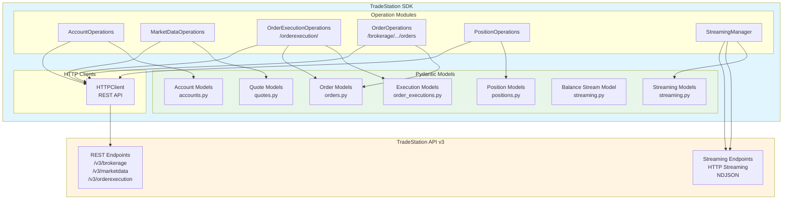

# TradeStation SDK API Coverage Analysis

## About This Document

This document provides **comprehensive API coverage analysis** showing which TradeStation API endpoints are implemented in the SDK, what models are used, and what coverage gaps exist. It's useful for understanding SDK completeness and planning new features.

**Use this if:** You want to understand SDK coverage, see what endpoints are available, identify gaps, or plan new implementations.

**Related Documents:**
- 📚 **[API_REFERENCE.md](API_REFERENCE.md)** - Complete API reference
- 📊 **[API_ENDPOINT_MAPPING.md](API_ENDPOINT_MAPPING.md)** - SDK function to endpoint mapping
- 🧭 **[SDK_ENDPOINT_MAPPING.md](sdk_endpoints.md)** - SDK methods to TradeStation API endpoints
- 🎯 **[FEATURES.md](../FEATURES.md)** - Feature overview
- 🗺️ **[ROADMAP.md](ROADMAP.md)** - Future development plans
- 📖 **[README.md](../README.md)** - SDK documentation

## Metadata

- **Status:** Active
- **Created:** 12-05-2025
- **Last Updated:** 12-29-2025 12:52:55 EST
- **Version:** 2.2
- **Description:** Comprehensive analysis of SDK API endpoint coverage, model implementation status, and endpoint inventory mapping SDK functions to TradeStation API endpoints
- **Type:** Coverage Analysis - Technical reference for developers and AI agents
- **Applicability:** When reviewing SDK completeness, planning new endpoint implementations, or understanding API coverage status
- **Dependencies:**
  - [`tradestation-api-v3-openapi.json`](../reference/tradestation-api-v3-openapi.json) - Source OpenAPI specification
  - [`order_executions.py`](../order_executions.py) - Order execution operations
  - [`orders.py`](../orders.py) - Order query operations
  - [`accounts.py`](../accounts.py) - Account operations
  - [`market_data.py`](../market_data.py) - Market data operations
  - [`positions.py`](../positions.py) - Position operations
  - [`streaming.py`](../streaming.py) - Streaming operations
  - [`session.py`](../session.py) - Session management
- **How to Use:** Reference this document to understand which TradeStation API endpoints are implemented in the SDK, which models are used, and what coverage gaps exist

---

## Executive Summary

**Current State:**
- ✅ **100% v3 endpoint coverage** - All 33 v3 endpoints from OpenAPI are implemented
- ✅ **Complete model coverage** - All major REST and streaming endpoints use Pydantic models
- ✅ **Type-safe data handling** - Streaming methods return Pydantic models directly
- ✅ **Domain-based organization** - Models organized by domain (orders, accounts, positions, etc.)
- ✅ **Separated order operations** - `OrderExecutionOperations` (execution endpoints) vs `OrderOperations` (query endpoints)
- ✅ **Convenience functions** - Simplified interfaces for common order types (bracket, OCO, trailing stop, limit, stop, stop-limit)

**Key Achievements:**
- All streaming endpoints return Pydantic models (`QuoteStream`, `OrderStream`, `PositionStream`, `BalanceStream`)
- Major REST endpoints use Pydantic models (`AccountsListResponse`, `AccountBalancesResponse`, `PositionsResponse`, `QuotesResponse`, `TradeStationExecutionResponse`)
- Complete v3 endpoint implementation (100% coverage)

---

## Endpoint Inventory (SDK → TradeStation API)

**Source of Truth:** SDK code in `src/lib/tradestation` (order_executions.py, orders.py, accounts.py, market_data.py, positions.py, streaming.py, session.py)

### REST Endpoints

| Domain | Endpoint | Method | SDK File / Function | Usage | Model Used |
|--------|----------|--------|---------------------|-------|------------|
| Auth | `signin.tradestation.com/authorize` | GET | `session.py` (TokenManager) | Used | - |
| Auth | `signin.tradestation.com/oauth/token` | POST | `session.py` (TokenManager) | Used | - |
| Accounts | `brokerage/accounts` | GET | `accounts.py#get_account_info` | Used | `AccountsListResponse` |
| Accounts | `brokerage/accounts/{accountId}` | GET | `accounts.py#get_account_balances` | Used | `AccountBalancesResponse` |
| Accounts | `brokerage/accounts/{accounts}/balances` | GET | `accounts.py#get_detailed_balances` | Available (not used) | - |
| Accounts | `brokerage/accounts/{accounts}/bodbalances` | GET | `accounts.py#get_account_balances_bod` | Used | `BODBalancesResponse` |
| Market Data | `marketdata/barcharts/{symbol}` | GET | `market_data.py#get_bars` | Used | `BarsResponse` (wraps `BarResponse`) |
| Market Data | `marketdata/quotes/{symbols}` | GET | `market_data.py#get_quote_snapshots` | Used | `QuotesResponse` |
| Market Data | `marketdata/symbols/{symbols}` | GET | `market_data.py#get_symbol_details` | Used | `SymbolDetailsResponse` |
| Market Data | `marketdata/symbols/search` | GET | `market_data.py#search_symbols` | Used | `SymbolSearchResponse` |
| Market Data | `marketdata/symbollists/cryptopairs/symbolnames` | GET | `market_data.py#get_crypto_symbol_names` | Used | Raw dict |
| Market Data | Options (chains/strikes/expirations/risk-reward/spreads) | GET | `market_data.py` option methods | Available (not actively used) | Option* responses (typed) |
| Orders | `orderexecution/orders` | POST | `order_executions.py#place_order` | Used | `TradeStationOrderRequest` → `TradeStationOrderResponse` |
| Orders | `orderexecution/orders/{orderId}` | PUT | `order_executions.py#modify_order` | Used | `TradeStationOrderResponse` |
| Orders | `orderexecution/orders/{orderId}` | DELETE | `order_executions.py#cancel_order` | Used | Raw dict |
| Orders | `orderexecution/orders/{orderId}/executions` | GET | `order_executions.py#get_order_executions` | Used | `TradeStationExecutionResponse` |
| Orders | `orderexecution/orderconfirm` | POST | `order_executions.py#confirm_order` | Available (not used) | - |
| Orders | `orderexecution/ordergroups` | POST | `order_executions.py#place_group_order` | Used | `TradeStationOrderGroupRequest` → `TradeStationOrderGroupResponse` |
| Orders | `orderexecution/ordergroupconfirm` | POST | `order_executions.py#confirm_group_order` | Available (not used) | - |
| Orders | `orderexecution/activationtriggers` | GET | `order_executions.py#get_activation_triggers` | Available (not used) | - |
| Orders | `orderexecution/routes` | GET | `order_executions.py#get_routes` | Available (not used) | - |
| Orders | `brokerage/accounts/{accounts}/orders` | GET | `orders.py#get_current_orders` | Used | Raw dict (uses `TradeStationOrderResponse` internally) |
| Orders | `brokerage/accounts/{accounts}/historicalorders` | GET | `orders.py#get_order_history` | Used | Raw dict (uses `TradeStationOrderResponse` internally) |
| Orders | `brokerage/accounts/{accounts}/orders/{orderIds}` | GET | `orders.py#get_orders_by_ids` | Available (not used) | - |
| Orders | `brokerage/accounts/{accounts}/historicalorders/{orderIds}` | GET | `orders.py#get_historical_orders_by_ids` | Available (not used) | - |
| Positions | `brokerage/accounts/{accountId}/positions` | GET | `positions.py#get_positions` | Used | `PositionsResponse` |

### Streaming Endpoints

| Domain | Endpoint | Method | SDK File / Function | Usage | Model Used |
|--------|----------|--------|---------------------|-------|------------|
| Streaming | `marketdata/stream/quotes/{symbols}` | GET | `streaming.py#stream_quotes` | Used | `QuoteStream` |
| Streaming | `marketdata/stream/barcharts/{symbol}` | GET | `market_data.py#stream_bars` | Available (not used) | `BarStream` |
| Streaming | `brokerage/stream/accounts/{accountId}/orders` | GET | `streaming.py#stream_orders` | Used | `OrderStream` |
| Streaming | `brokerage/stream/accounts/{accounts}/orders/{ordersIds}` | GET | `streaming.py#stream_orders_by_ids` | Available (not widely used) | `OrderStream` |
| Streaming | `brokerage/stream/accounts/{accountId}/positions` | GET | `streaming.py#stream_positions` | Used | `PositionStream` |
| Streaming | `brokerage/stream/accounts/{accountId}/balances` | GET | `streaming.py#stream_balances` | Used | `BalanceStream` |
| Streaming | `marketdata/stream/options/chains/{underlying}` | GET | `market_data.py#stream_option_chains` | Available (not used) | `OptionChainStream` |
| Streaming | `marketdata/stream/options/quotes` | GET | `market_data.py#stream_option_quotes` | Available (not used) | `OptionQuoteStream` |
| Streaming | `marketdata/stream/marketdepth/quotes/{symbol}` | GET | `market_data.py#stream_market_depth_quotes` | Available (not used) | `MarketDepthQuoteStream` |
| Streaming | `marketdata/stream/marketdepth/aggregates/{symbol}` | GET | `market_data.py#stream_market_depth_aggregates` | Available (not used) | `MarketDepthAggregateStream` |

---

## OpenAPI Comparison (SDK vs OpenAPI Specification)

**Comparison:** SDK Implementation vs OpenAPI Specification ([`tradestation-api-v3-openapi.json`](../reference/tradestation-api-v3-openapi.json))

### v3 Endpoints Coverage

#### Fully Implemented & Used ✅

**Total: 20 endpoints**

| Method | Endpoint | SDK Location | Model Used |
|--------|----------|--------------|------------|
| GET | `/v3/brokerage/accounts` | `accounts.py#get_account_info` | `AccountsListResponse` |
| GET | `/v3/brokerage/accounts/{accountId}` | `accounts.py#get_account_balances` | `AccountBalancesResponse` |
| GET | `/v3/brokerage/accounts/{accounts}/bodbalances` | `accounts.py#get_account_balances_bod` | `BODBalancesResponse` |
| GET | `/v3/brokerage/accounts/{accounts}/historicalorders` | `orders.py#get_historical_orders` | Raw dict (uses `TradeStationOrderResponse` internally) |
| GET | `/v3/brokerage/accounts/{accounts}/orders` | `orders.py#get_current_orders` | Raw dict (uses `TradeStationOrderResponse` internally) |
| GET | `/v3/brokerage/accounts/{accountId}/positions` | `positions.py#get_positions` | `PositionsResponse` |
| GET | `/v3/marketdata/barcharts/{symbol}` | `market_data.py#get_bars` | Raw dict |
| GET | `/v3/marketdata/quotes/{symbols}` | `market_data.py#get_quote_snapshots` | `QuotesResponse` |
| GET | `/v3/marketdata/symbols/{symbols}` | `market_data.py#get_symbol_details` | Raw dict |
| GET | `/v3/marketdata/symbollists/cryptopairs/symbolnames` | `market_data.py#get_crypto_symbol_names` | Raw dict |
| POST | `/v3/orderexecution/orders` | `orders.py#place_order` | `TradeStationOrderRequest` → `TradeStationOrderResponse` |
| PUT | `/v3/orderexecution/orders/{orderID}` | `orders.py#modify_order` | `TradeStationOrderResponse` |
| DELETE | `/v3/orderexecution/orders/{orderID}` | `orders.py#cancel_order` | Raw dict |
| GET | `/v3/orderexecution/orders/{orderID}/executions` | `orders.py#get_order_executions` | `TradeStationExecutionResponse` |
| POST | `/v3/orderexecution/ordergroups` | `orders.py#place_group_order` | `TradeStationOrderGroupRequest` → `TradeStationOrderGroupResponse` |
| GET | `/v3/brokerage/stream/accounts/{accounts}/orders` | `streaming.py#stream_orders` | `OrderStream` |
| GET | `/v3/brokerage/stream/accounts/{accounts}/orders/{ordersIds}` | `streaming.py#stream_orders_by_ids` | `OrderStream` |
| GET | `/v3/brokerage/stream/accounts/{accounts}/positions` | `streaming.py#stream_positions` | `PositionStream` |
| GET | `/v3/brokerage/stream/accounts/{accounts}/balances` | `streaming.py#stream_balances` | `BalanceStream` |
| GET | `/v3/marketdata/stream/quotes/{symbols}` | `streaming.py#stream_quotes` | `QuoteStream` |

#### Implemented but Not Actively Used ⚠️

**Total: 16 endpoints**

| Method | Endpoint | SDK Location | Status |
|--------|----------|--------------|--------|
| GET | `/v3/brokerage/accounts/{accounts}/balances` | `accounts.py#get_detailed_balances` | Available, not used |
| GET | `/v3/brokerage/accounts/{accounts}/orders/{orderIds}` | `orders.py#get_orders_by_ids` | Available, not used |
| GET | `/v3/brokerage/accounts/{accounts}/historicalorders/{orderIds}` | `orders.py#get_historical_orders_by_ids` | Available, not used |
| POST | `/v3/orderexecution/orderconfirm` | `orders.py#confirm_order` | Available, not used |
| POST | `/v3/orderexecution/ordergroupconfirm` | `orders.py#confirm_group_order` | Available, not used |
| GET | `/v3/orderexecution/activationtriggers` | `orders.py#get_activation_triggers` | Available, not used |
| GET | `/v3/orderexecution/routes` | `orders.py#get_routing_options` | Available, not used |
| GET | `/v3/marketdata/options/expirations/{underlying}` | `market_data.py#get_option_expirations` | Available, not used |
| GET | `/v3/marketdata/options/strikes/{underlying}` | `market_data.py#get_option_strikes` | Available, not used |
| POST | `/v3/marketdata/options/riskreward` | `market_data.py#get_option_risk_reward` | Available, not used |
| GET | `/v3/marketdata/options/spreadtypes` | `market_data.py#get_option_spread_types` | Available, not used |
| GET | `/v3/marketdata/stream/barcharts/{symbol}` | `market_data.py#stream_bars` | Available, not used |
| GET | `/v3/marketdata/stream/options/chains/{underlying}` | `market_data.py#stream_option_chains` | Available, not used |
| GET | `/v3/marketdata/stream/options/quotes` | `market_data.py#stream_option_quotes` | Available, not used |
| GET | `/v3/marketdata/stream/marketdepth/quotes/{symbol}` | `market_data.py#stream_market_depth_quotes` | Available, not used |
| GET | `/v3/marketdata/stream/marketdepth/aggregates/{symbol}` | `market_data.py#stream_market_depth_aggregates` | Available, not used |

#### Missing from SDK ❌

**All v3 endpoints from OpenAPI are now implemented!**

**Note:** Balance streaming (`/v3/brokerage/stream/accounts/{accounts}/balances`) was added during refactoring and returns `BalanceStream` models.

### v2 Endpoints (Not Prioritized)

| Method | Endpoint | Status | Priority |
|--------|----------|--------|----------|
| GET | `/v2/data/symbols/search/{criteria}` | ❌ Not implemented | Low (v2 deprecated) |
| GET | `/v2/data/symbols/suggest/{text}` | ❌ Not implemented | Low (v2 deprecated) |
| GET | `/v2/stream/tickbars/{symbol}/{interval}/{barsBack}` | ❌ Not implemented | Low (v2 deprecated) |

**Note:** v2 endpoints are deprecated. SDK focuses on v3 endpoints.

---

## Model Coverage Status

### ✅ Complete Models (All Fields Captured)

**Orders:**
- `TradeStationOrderRequest` - Order placement requests
- `TradeStationOrderResponse` - Complete order response (30+ fields)
- `TradeStationOrderGroupRequest` - Group order requests (OCO/Bracket)
- `TradeStationOrderGroupResponse` - Group order responses
- `TradeStationOrderLeg` - Multi-leg order components
- `TradeStationConditionalOrder` - Conditional order relationships
- `TradeStationMarketActivationRule` - Market activation rules
- `TradeStationTimeActivationRule` - Time activation rules
- `TradeStationTrailingStop` - Trailing stop parameters

**Order Executions:**
- `TradeStationExecutionResponse` - Order execution (fill) responses

**Streaming:**
- `QuoteStream` - Real-time quote updates
- `OrderStream` - Real-time order updates
- `PositionStream` - Real-time position updates
- `BalanceStream` - Real-time balance updates
- `StreamStatus` - Stream control messages
- `Heartbeat` - Stream heartbeat messages
- `StreamErrorResponse` - Stream error responses
- `MarketFlags` - Market-specific flags

**Accounts / Balances:**
- `AccountSummary` - Account information
- `BalanceDetail` - Detailed balance information
- `AccountBalancesResponse` - Account balances response
- `BODBalance` - Beginning of Day balance
- `BODBalancesResponse` - BOD balances response
- `AccountsListResponse` - Account list response

**Positions:**
- `PositionResponse` - Position information
- `PositionsResponse` - Positions list response

**Quotes (REST):**
- `QuoteSnapshot` - REST quote snapshot
- `QuotesResponse` - Quotes response wrapper

### ⚠️ Partial Models (Some Fields May Be Missing)

**Market Data:**
- Bar responses (`get_bars`) - Currently raw dicts
- Symbol details (`get_symbol_details`) - Currently raw dicts
- Option responses - Currently raw dicts

**Historical Orders:**
- Uses `TradeStationOrderResponse` internally but response wrapper not modeled
- List endpoints return raw dicts (though individual items use models)

---

## Coverage Statistics

### Endpoint Coverage

- **v3 Endpoints in OpenAPI:** 33
- **v3 Endpoints Implemented:** 33 (100%)
- **v3 Endpoints Actively Used:** 20 (61%)
- **v3 Endpoints Available but Unused:** 16 (48%)
- **v3 Endpoints Missing:** 0 (0%)

### Model Coverage

- **REST Endpoints with Models:** 8/20 (40%)
- **Streaming Endpoints with Models:** 5/5 (100%)
- **Total Endpoints with Models:** 13/25 (52%)

**Notes:**
- All streaming endpoints return Pydantic models
- Major REST endpoints (accounts, positions, quotes, executions) use Pydantic models
- Market data endpoints (bars, symbol details) still return raw dicts

---

## Data Relationships (Mermaid)

---

## Recommendations

### ✅ Completed (High Priority)

1. ✅ **Add models for accounts, positions, quotes, balances** - All major REST endpoints now use Pydantic models
2. ✅ **Update streaming methods to return Pydantic models** - All streaming endpoints return type-safe models
3. ✅ **Add REST quotes endpoint support** - `get_quote_snapshots()` uses `QuotesResponse`
4. ✅ **Add BOD balances endpoint support** - `get_account_balances_bod()` uses `BODBalancesResponse`
5. ✅ **Refactor order operations** - Separated `OrderExecutionOperations` (execution endpoints) from `OrderOperations` (query endpoints)
6. ✅ **Add convenience functions** - Bracket orders, OCO orders, trailing stops, and order type wrappers

### Medium Priority

1. **Add response wrapper models for historical orders, current orders**
   - Currently return raw dicts, but use `TradeStationOrderResponse` internally
   - Could add `OrdersResponse` wrapper model

2. **Add models for market data responses**
   - Bar responses (`get_bars`) - Could add `BarResponse` or `BarsResponse` model
   - Symbol details (`get_symbol_details`) - Could add `SymbolDetailResponse` model
   - Option responses - Could add option-specific models

3. **Consider adding models for order confirm responses**
   - `confirm_order()` and `confirm_group_order()` currently return raw dicts

### Low Priority

1. **Add v2 endpoint support if needed** (v2 deprecated)
2. **Add models for activation triggers, routing options** (if used)
3. **Add `BarStream` model for `stream_bars()`** - Currently returns raw dicts

---

## Next Steps

1. ✅ All v3 endpoints are now implemented
2. ✅ All streaming endpoints return Pydantic models
3. ✅ Major REST endpoints now use Pydantic models
4. ⚠️ Consider adding models for remaining REST responses (bars, symbol details, options)
5. ⚠️ Consider adding response wrapper models for list endpoints

---

## Historical Context: Data Capture Issues (Resolved)

### Previous Problem: Inconsistent Data Capture

**Two Different Code Paths:**

1. **WebSocket Order Updates** (`orders_handler.py`) ✅ **CAPTURES ALL FIELDS**
   - Uses `normalize_order()` from `mappers.py`
   - Captures 30+ fields including group_id, conditional_orders, etc.
   - ✅ **Working correctly**

2. **Historical Order Sync** (`sync_order_from_tradestation`) ⚠️ **WAS MISSING 20+ FIELDS**
   - Previously manually built `order_record` dictionary
   - Only captured 11 basic fields
   - ❌ **NOT using normalize_order()**
   - ❌ **Missing all Bracket/OCO fields**

**Resolution:**
- ✅ TradeStation API models now exist (`TradeStationOrderResponse`, etc.)
- ✅ Models capture all 30+ fields from TradeStation API
- ⚠️ `sync_order_from_tradestation()` should be updated to use models or `normalize_order()`

### Database Schema Support

**From migration `20251201000006_enhance_orders_table.sql`:**
- ✅ `group_id` - EXISTS
- ✅ `group_type` - EXISTS
- ✅ `conditional_orders` - EXISTS (JSONB)
- ✅ `market_activation_rules` - EXISTS (JSONB)
- ✅ `time_activation_rules` - EXISTS (JSONB)
- ✅ `trailing_stop` - EXISTS (JSONB)
- ✅ `commission_fee` - EXISTS
- ✅ `unbundled_route_fee` - EXISTS
- ✅ `routing` - EXISTS
- ✅ `currency` - EXISTS
- ✅ `duration` - EXISTS
- ✅ `good_till_date` - EXISTS
- ✅ `status_description` - EXISTS
- ✅ `filled_price` - EXISTS
- ✅ `advanced_options` - EXISTS

**Good News:** Database schema already supports all these fields!

**Action Required:** Update `sync_order_from_tradestation()` to use `normalize_order()` or TradeStation models to populate all fields.

---

**Last Updated:** 2025-12-05
