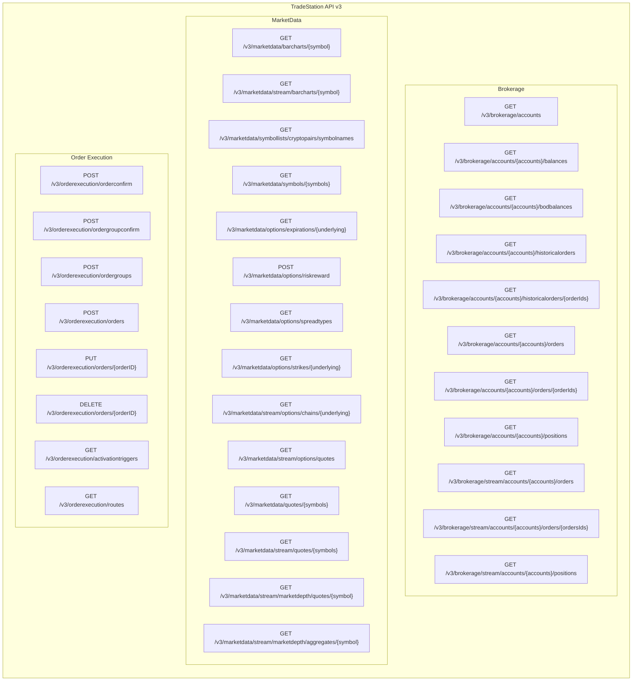

# TradeStation API v3 Structure

## Metadata

- **Version:** 1.1
- **Last Updated:** 12-28-2025 EST
- **Type:** Architecture Diagram
- **Status:** Active
- **Description:** Visual diagrams showing TradeStation API v3 endpoint structure organized by tag groups (Brokerage, MarketData, Order Execution) with detailed relationships
- **Applicability:** When understanding API structure, planning SDK enhancements, or reviewing endpoint coverage
- **Dependencies:**
  - [`tradestation-api-v3-openapi.json`](../../reference/tradestation-api-v3-openapi.json) - Source OpenAPI specification
- **Related Documents:**
  - [API Reference](reference.md) - Complete API reference
  - [API Coverage](coverage.md) - Endpoint coverage analysis
  - [SDK Endpoint Mapping](sdk_endpoints.md) - Endpoint mapping

---

## API Structure Overview

## Detailed API Structure

```mermaid
graph LR
    subgraph "TradeStation API v3 Endpoints"
        direction TB
        Brokerage["Brokerage<br/>11 endpoints"]
        Brokerage --> v3brokerageaccounts["GET<br/>accounts"]
        Brokerage --> v3brokerageaccountsa["GET<br/>balances"]
        Brokerage --> v3brokerageaccountsa2["GET<br/>bodbalances"]
        Brokerage --> v3brokerageaccountsa3["GET<br/>historicalorders"]
        Brokerage --> v3brokerageaccountsa4["GET<br/>{orderIds}"]
        MarketData["MarketData<br/>14 endpoints"]
        MarketData --> v3marketdatabarchart["GET<br/>barcharts/{symbol}"]
        MarketData --> v3marketdatastreamba["GET<br/>stream/barcharts"]
        MarketData --> v3marketdatasymbolli["GET<br/>cryptopairs"]
        MarketData --> v3marketdatasymbolss["GET<br/>symbols/{symbols}"]
        MarketData --> v3marketdataoptionse["GET<br/>options/expirations"]
        OrderExecution["Order Execution<br/>8 endpoints"]
        OrderExecution --> v3orderexecutionorde["POST<br/>orderconfirm"]
        OrderExecution --> v3orderexecutionorde2["POST<br/>ordergroupconfirm"]
        OrderExecution --> v3orderexecutionorde3["POST<br/>ordergroups"]
        OrderExecution --> v3orderexecutionorde4["POST<br/>orders"]
        OrderExecution --> v3orderexecutionorde5["PUT<br/>orders/{orderID}"]
    end
```

**Note:** The detailed diagram shows a subset of endpoints for clarity. The overview diagram above shows all 33 endpoints.

---

## Endpoint Summary

- **Brokerage:** 11 endpoints (account, position, order management)
- **MarketData:** 14 endpoints (market data, quotes, symbols, streaming)
- **Order Execution:** 8 endpoints (order placement, modification, cancellation)
- **Total:** 33 v3 endpoints

---

## How to View These Diagrams

### In Cursor/VS Code
- The diagrams will render automatically in the markdown preview
- Open this file and use the preview pane (Cmd+Shift+V / Ctrl+Shift+V)

### In GitHub
- Navigate to the file on GitHub - diagrams render automatically

### Online
- Copy the Mermaid code block and paste into [Mermaid Live Editor](https://mermaid.live)
- Or use any Mermaid-compatible viewer

### In Other Markdown Viewers
- Most modern markdown viewers (Obsidian, Typora, etc.) support Mermaid diagrams
- Some may require Mermaid plugin/extension

---

**Related Files:**
- [`tradestation-api-v3-openapi.json`](../../reference/tradestation-api-v3-openapi.json) - Complete OpenAPI specification
- [API Reference](reference.md) - Complete API reference
- [API Coverage](coverage.md) - Endpoint coverage analysis
