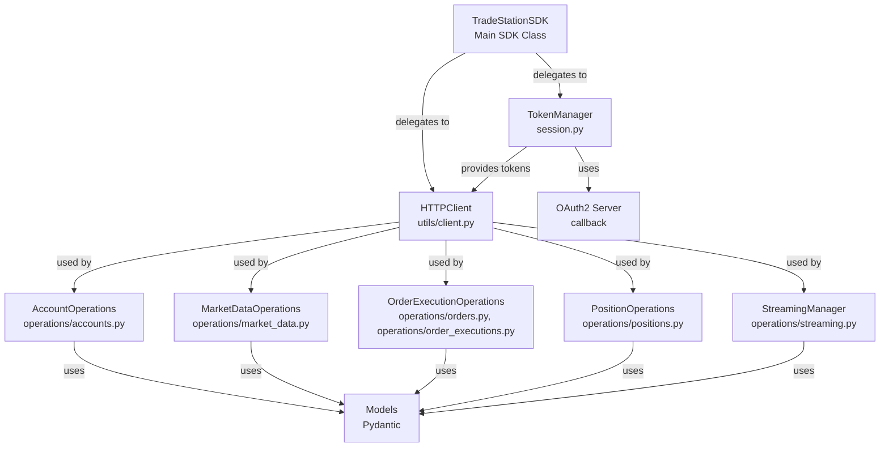
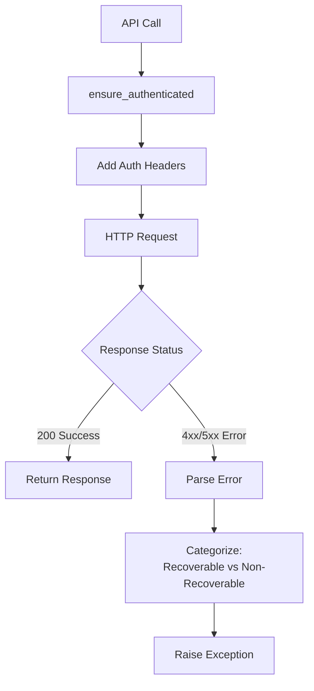
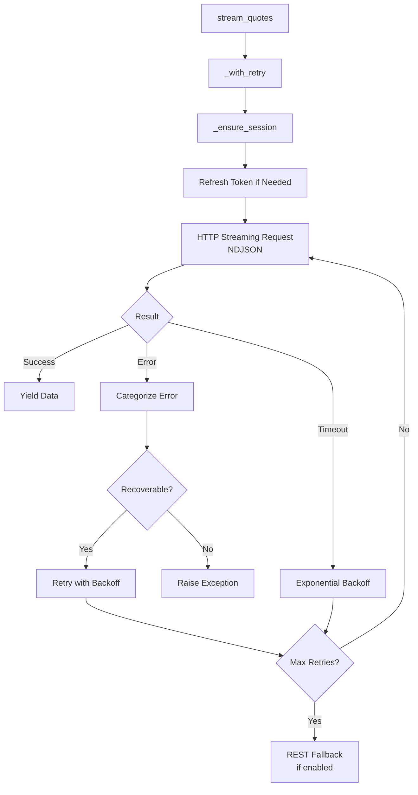
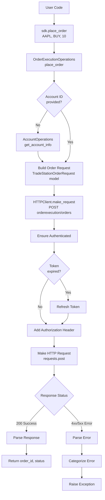
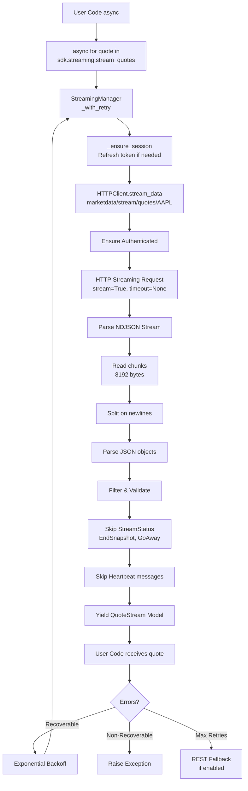
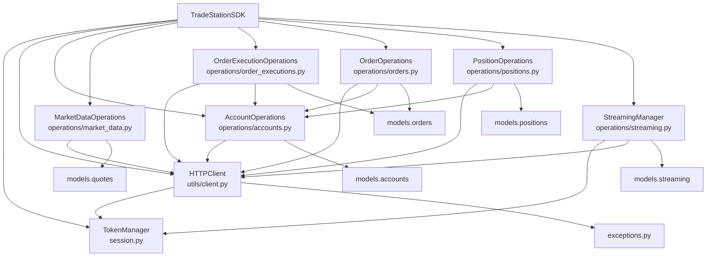
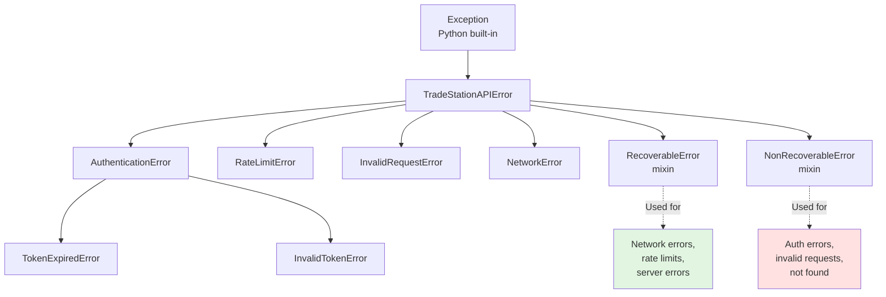
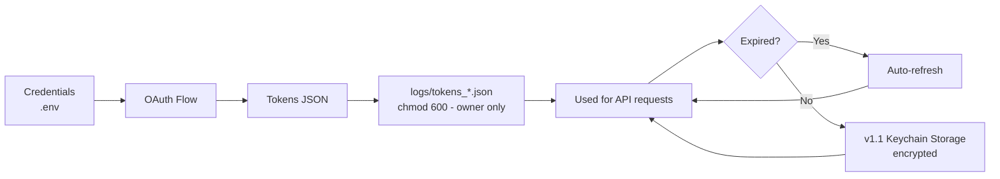
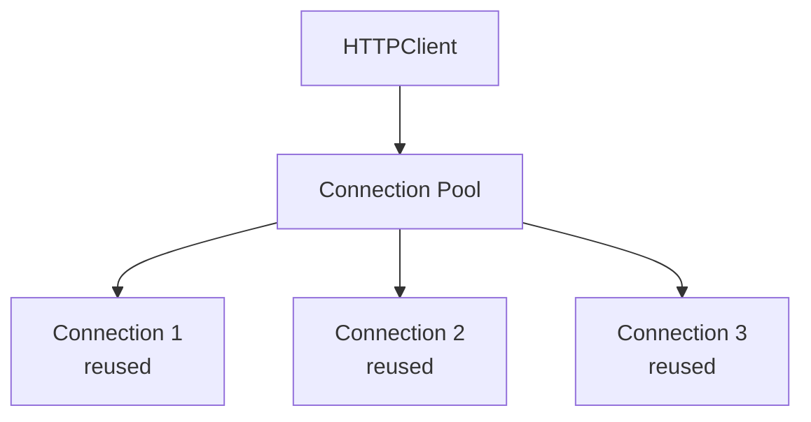
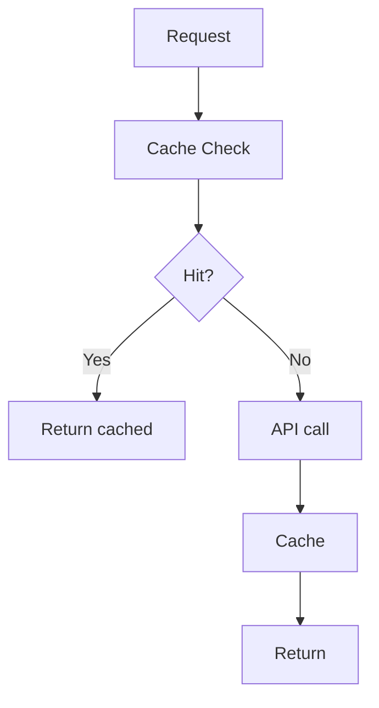

# TradeStation SDK - Architecture

## About This Document

This document provides a **visual overview of SDK architecture**, design decisions, data flow, and component relationships. It includes diagrams and explanations of how the SDK is structured internally.

**Use this if:** You want to understand SDK internals, see how components interact, or understand design decisions.

**Related Documents:**
- 📖 **[README.md](../README.md)** - SDK overview and user-facing documentation
- 📚 **[docs/README.md](README.md)** - Technical service documentation
- 📚 **[API_REFERENCE.md](API_REFERENCE.md)** - Complete API reference
- 🏗️ **[MODELS.md](MODELS.md)** - Pydantic model documentation
- 📊 **[API_ENDPOINT_MAPPING.md](API_ENDPOINT_MAPPING.md)** - Endpoint mappings

---

Visual overview of SDK architecture, design decisions, and data flow.

---

## High-Level Architecture



---

## Component Breakdown

### 1. TradeStationSDK (Main Class)

**Role:** Central orchestrator and unified interface

**Responsibilities:**
- Composes all modules (accounts, orders, positions, etc.)
- Delegates operations to appropriate modules
- Manages authentication state
- Provides convenience functions
- Exposes operation modules as properties

**Key Methods:**
```python
# Authentication
sdk.authenticate(mode)
sdk.ensure_authenticated(mode)

# Account operations
sdk.get_account_info(mode)
sdk.get_account_balances(mode)

# Market data
sdk.get_bars(symbol, interval, unit, bars_back, mode)
sdk.get_quote_snapshots(symbols, mode)

# Order operations
sdk.place_order(symbol, side, quantity, ...)
sdk.cancel_order(order_id, mode)

# Position operations
sdk.get_position(symbol, mode)
sdk.flatten_position(symbol, mode)

# Streaming
sdk.streaming.stream_quotes(symbols, mode)
```

---

### 2. TokenManager (Authentication)

**Role:** OAuth2 authentication and token lifecycle management

**Responsibilities:**
- OAuth2 Authorization Code flow
- Token storage (PAPER and LIVE separately)
- Automatic token refresh
- Token validation
- HTTP callback server

**Token Lifecycle:**

```mermaid
flowchart LR
    User[User] --> Auth[authenticate]
    Auth --> Browser[Browser Opens]
    Browser --> Login[User Logs In]
    Login --> Callback[Callback with Code]
    Callback --> Exchange[Exchange Code for<br/>Access + Refresh Tokens]
    Exchange --> Save[Save to<br/>logs/tokens_{mode}.json]
    Save --> Use[Use Access Token<br/>20min lifespan]
    Use --> Expires[Token Expires]
    Expires --> Refresh[Auto Refresh]
    Refresh --> NewToken[Get New Access Token<br/>via Refresh Token]
    NewToken --> Use
```

**Files:**
- `session.py` - TokenManager, OAuth flow, token storage
- `logs/tokens_paper.json` - PAPER mode tokens
- `logs/tokens_live.json` - LIVE mode tokens

---

### 3. HTTPClient (Request Handler)

**Role:** HTTP communication with TradeStation API

**Responsibilities:**
- Make authenticated API requests
- Add authorization headers
- Handle request/response logging
- Parse and categorize errors
- Support HTTP Streaming (long-lived connections)
- Sanitize sensitive data in logs

**Request Flow:**



**Error Categorization:**
- **Recoverable:** Network errors, rate limits, server errors (5xx)
- **Non-Recoverable:** Auth errors (401/403), invalid requests (400), not found (404)

---

### 4. Operation Modules

Each module handles a specific domain:

**AccountOperations (`operations/accounts.py`):**
- Get account information
- Get account balances (basic, detailed, BOD)
- Multi-account support

**MarketDataOperations (`operations/market_data.py`):**
- Historical bars
- Symbol search
- Quote snapshots
- Symbol details
- Futures/crypto symbols
- Option expirations, strikes

**OrderExecutionOperations (`operations/order_executions.py`):**
- Place orders (all types)
- Cancel orders
- Modify orders
- Order confirmations
- Group orders (Bracket, OCO)
- Convenience functions

**OrderOperations (`operations/orders.py`):**
- Order history queries
- Current orders
- Orders by ID
- Orders by status
- Order streaming

**PositionOperations (`operations/positions.py`):**
- Get positions
- Flatten positions
- Position streaming
- P&L calculations

---

### 5. StreamingManager (Real-Time Data)

**Role:** Manage HTTP Streaming connections for real-time data

**Architecture:**



**Features:**
- Automatic reconnection (exponential backoff)
- REST polling fallback
- Stream health tracking
- Session auto-recovery
- Error categorization
- Configurable retry logic

---

### 6. Models (Type Safety)

**Role:** Pydantic models for type-safe API interactions

**Model Categories:**

**Request Models:**
- `TradeStationOrderRequest` - Order placement
- `TradeStationOrderGroupRequest` - Group orders (Bracket, OCO)

**REST Response Models:**
- `TradeStationOrderResponse` - Order details (30+ fields)
- `TradeStationExecutionResponse` - Order fills
- `AccountBalancesResponse` - Account balances
- `PositionResponse` - Position details
- `QuoteSnapshot` - Quote data

**Streaming Response Models:**
- `QuoteStream` - Real-time quotes (50+ fields)
- `OrderStream` - Real-time order updates
- `PositionStream` - Real-time position updates
- `BalanceStream` - Real-time balance updates
- `StreamStatus` - Control messages
- `Heartbeat` - Keep-alive messages

**Why Separate Models for Streaming?**
- Streaming responses have different fields than REST
- Example: QuoteStream has `High52Week`, REST doesn't
- Type safety for both contexts

---

## Data Flow Examples

### Example 1: Placing an Order



---

### Example 2: Streaming Quotes



---

## Design Decisions

### Why HTTP Streaming, Not WebSocket?

**Reason:** TradeStation API v3 uses HTTP Streaming, not WebSocket.

**Trade-offs:**
- ✅ Simpler implementation (standard HTTP)
- ✅ Better firewall compatibility
- ✅ Easier debugging (HTTP tools)
- ❌ Slightly higher latency (10-50ms)
- ❌ More complex connection management

**Future:** If TradeStation adds WebSocket, we'll implement native support in v2.0.

---

### Why Separate PAPER/LIVE Tokens?

**Reason:** Safety and isolation.

**Benefits:**
- Can't accidentally trade LIVE when testing
- Different accounts for PAPER and LIVE
- Clear separation of concerns
- Independent token lifecycles

**Trade-off:** Need to authenticate both modes separately.

---

### Why Convenience Functions?

**Reason:** Simplify common operations.

**Example:**
```python
# Without convenience function (low-level)
order_dict = {
    "AccountID": account_id,
    "Symbol": "AAPL",
    "TradeAction": "Buy",
    "OrderType": "Limit",
    "Quantity": "10",
    "LimitPrice": "150.00",
    "TimeInForce": {"Duration": "DAY"}
}
result = sdk.order_executions.place_order_raw(order_dict, mode="PAPER")

# With convenience function (high-level)
order_id, status = sdk.place_limit_order(
    symbol="AAPL",
    side="BUY",
    quantity=10,
    limit_price=150.00,
    mode="PAPER"
)
```

**Benefits:**
- Simpler, more readable code
- Built-in validation
- Better error messages
- Type safety

**Trade-off:** Less flexibility for advanced use cases (still available via low-level).

---

### Why Pydantic Models?

**Reason:** Type safety and data validation.

**Benefits:**
- Catch errors at parse time, not runtime
- IDE autocomplete and type hints
- Automatic validation
- Consistent data structures
- Self-documenting code

**Example:**
```python
# Without models (error-prone)
quote = response_dict
print(quote['last'])  # KeyError if field missing

# With models (type-safe)
quote = QuoteStream(**response_dict)
print(quote.Last)  # AttributeError caught by Pydantic
```

---

## Module Dependencies



---

## Data Structures

### Token Storage

```json
{
  "access_token": "eyJhbGciOiJSUzI1NiIsInR5cCI6IkpXVCJ9...",
  "refresh_token": "abc123...",
  "expires_in": 1200,
  "token_type": "Bearer",
  "scope": "MarketData ReadAccount Trade Crypto",
  "expires_at": 1234567890.123
}
```

**Stored in:**
- `logs/tokens_paper.json` - PAPER mode
- `logs/tokens_live.json` - LIVE mode

---

### API Response Examples

**Account Response:**
```json
{
  "Accounts": [
    {
      "AccountID": "SIM123456",
      "Alias": "Paper Trading Account",
      "AccountType": "Futures",
      "Status": "Active",
      "Currency": "USD"
    }
  ]
}
```

**Quote Response:**
```json
{
  "Quotes": [
    {
      "Symbol": "AAPL",
      "Last": 150.25,
      "Bid": 150.24,
      "Ask": 150.26,
      "Volume": 1234567,
      "High": 151.50,
      "Low": 149.75
    }
  ]
}
```

**Order Response:**
```json
{
  "Orders": [
    {
      "OrderID": "924243071",
      "AccountID": "SIM123456",
      "Symbol": "AAPL",
      "TradeAction": "Buy",
      "OrderType": "Limit",
      "Quantity": "10",
      "LimitPrice": "150.00",
      "Status": "ACK",
      "StatusDescription": "Acknowledged"
    }
  ]
}
```

---

## Error Handling Architecture

### Exception Hierarchy



### ErrorDetails Structure

```python
@dataclass
class ErrorDetails:
    code: str                          # "INVALID_REQUEST"
    message: str                       # "Order placement failed"
    api_error_code: str                # "INVALID_SYMBOL"
    api_error_message: str             # From TradeStation
    request_method: str                # "POST"
    request_endpoint: str              # "orderexecution/orders"
    request_params: dict               # Query params (sanitized)
    request_body: dict                 # Request body (sanitized)
    response_status: int               # 400
    response_body: dict                # Error response
    mode: str                          # "PAPER" or "LIVE"
    operation: str                     # "place_order"
```

**Usage:**
```python
try:
    sdk.place_order(...)
except TradeStationAPIError as e:
    # Human-readable
    print(e)  # Calls e.details.to_human_readable()
    
    # Structured
    error_dict = e.to_dict()
    print(error_dict['api_error_code'])
```

---

## Performance Characteristics

### API Request Latency

| Operation | Typical Latency | Notes |
|-----------|----------------|-------|
| Authentication | 2-5 seconds | One-time OAuth flow |
| Token refresh | 100-300ms | Automatic |
| Account info | 100-200ms | Cached internally |
| Market data | 100-300ms | Depends on data size |
| Order placement | 200-500ms | TradeStation processing |
| Order cancellation | 100-300ms | Fast |
| Position query | 100-200ms | Cached on TS side |

### Streaming Performance

| Stream Type | Latency | Update Frequency |
|-------------|---------|-----------------|
| Quotes | 50-100ms | Real-time (tick-by-tick) |
| Orders | 100-300ms | On status change |
| Positions | 100-300ms | On position update |
| Balances | 100-500ms | On balance change |

---

## Threading Model

**Current (v1.x):**
- Synchronous HTTP client (requests library)
- Streaming uses threading for async bridge
- One thread per stream

**Future (v2.0):**
- Native async with httpx/aiohttp
- No threading overhead
- Better concurrency

---

## Memory Usage

**Typical Usage:**
- SDK initialization: ~10MB
- Per stream: ~5-10MB
- Token storage: <1KB
- Response caching: ~5-50MB (when implemented)

**Recommendations:**
- Close unused streams
- Limit concurrent streams to 5-10
- Use batch operations when possible

---

## Security Architecture

### Token Security



### Data Sanitization

**Sensitive fields are automatically redacted in logs:**
- `client_secret`
- `refresh_token`
- `access_token`
- `Authorization` headers
- `code` (OAuth)
- `password`

**Example log:**
```
Request Body: {
  "client_id": "abc123",
  "client_secret": "***REDACTED***",
  "code": "***REDACTED***"
}
```

---

## Extension Points

### Custom Token Storage

```python
class CustomTokenManager(TokenManager):
    def save_tokens(self, mode: str, tokens: dict):
        # Your custom storage logic
        encrypted = encrypt(tokens)
        save_to_database(mode, encrypted)
    
    def load_tokens(self, mode: str) -> dict:
        # Your custom retrieval logic
        encrypted = load_from_database(mode)
        return decrypt(encrypted)
```

### Custom Error Handling

```python
class CustomSDK(TradeStationSDK):
    def place_order(self, *args, **kwargs):
        try:
            return super().place_order(*args, **kwargs)
        except TradeStationAPIError as e:
            # Custom error handling
            self.notify_error(e)
            raise
```

### Custom Logging

```python
import logging

class CustomHTTPClient(HTTPClient):
    def make_request(self, *args, **kwargs):
        # Log to custom destination
        logging.info(f"API Request: {args}")
        return super().make_request(*args, **kwargs)
```

---

## Configuration

### Environment Variables

| Variable | Required | Default | Notes |
|----------|----------|---------|-------|
| `TRADESTATION_CLIENT_ID` | Yes | None | OAuth client ID |
| `TRADESTATION_CLIENT_SECRET` | Yes | None | OAuth client secret |
| `TRADESTATION_REDIRECT_URI` | No | `http://localhost:8888/callback` | OAuth callback (register all ports 8888-8898 in Developer Portal for auto-selection) |
| `TRADESTATION_OAUTH_PORT` | No | Auto-select 8888-8898 | Explicit OAuth port override |
| `TRADING_MODE` | No | `PAPER` | PAPER or LIVE |
| `TRADESTATION_ACCOUNT_ID` | No | Auto-detect | Account to use |
| `LOG_LEVEL` | No | `INFO` | DEBUG, INFO, WARNING, ERROR |
| `TRADESTATION_FULL_LOGGING` | No | `false` | Full request/response logging |

---

## Future Architecture (v2.0)

### Async-First Design

```
async def main():
    sdk = TradeStationSDK()
    await sdk.authenticate(mode="PAPER")
    
    account = await sdk.get_account_info(mode="PAPER")
    
    async for quote in sdk.streaming.stream_quotes(["AAPL"]):
        print(quote.Last)
```

### Connection Pooling



### Caching Layer



---

## Related Documentation

- [API Coverage](API_COVERAGE.md) - Endpoint implementation status
- [Models](MODELS.md) - Complete model documentation
- [API Reference](API_REFERENCE.md) - Function reference

---

**Last Updated:** 2025-12-07  
**SDK Version:** 1.0.0
